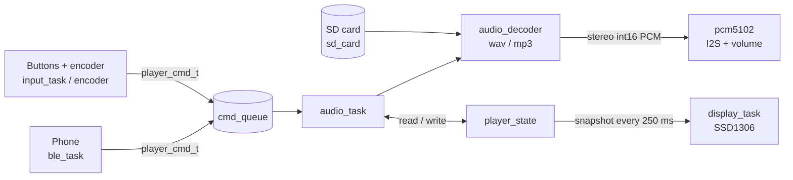

# ESP32-S3 Audio Player

> A portable MP3 / WAV player on ESP32-S3: software decoding, I2S DAC, SD card, OLED UI, and control from buttons, an encoder or a phone over BLE.

[](https://platformio.org/)
[](https://www.espressif.com/en/products/socs/esp32-s3)
[](https://www.freertos.org/)
[](LICENSE)

<!-- TODO: add a photo of the device and a short demo gif here -->

## About

The firmware reads `.mp3` and `.wav` files from an SD card, decodes them on the ESP32-S3 and plays them
through a PCM5102 DAC over I2S. A 128x64 OLED shows the track list, elapsed / total time and the
volume. Local controls (3 buttons + a rotary encoder) and a BLE phone control feed the same command
queue, so they are interchangeable.

It is the final project of an embedded systems course, written in C on native ESP-IDF with FreeRTOS.
It combines SPI, I2C, I2S, GPIO interrupts, PCNT and BLE in one real device.

**Features**

- MP3 (Helix, MPEG Layer III) and WAV (16-bit PCM, mono / stereo); exact MP3 duration from the Xing/Info header
- Track list with a highlighted current track; a long title scrolls horizontally
- Play / pause, next, previous, volume with the encoder, mute with the encoder click
- Auto-advance to the next track
- SD hot-plug: warning screen on removal; on return the card is re-scanned and the current track restarts
- Debug options in `menuconfig` instead of code edits

## Quick start

### Requirements

- [PlatformIO](https://platformio.org/) (CLI or the VS Code extension)
- ESP32-S3-DevKitM-1 wired as described below
- microSD card formatted as **FAT32** with `.mp3` / `.wav` files in the root directory (up to 64
  tracks; subfolders and hidden files such as macOS `._*` are ignored)

### Hardware

| Part | Role |
|---|---|
| ESP32-S3-DevKitM-1 | MCU |
| PCM5102 I2S DAC module | Audio output (line level) |
| microSD SPI module | Track storage |
| SSD1306 128x64 OLED (I2C) | UI |
| EC11 rotary encoder with push switch | Volume / mute |
| 3 push buttons | Play/Pause, Next, Prev |

| Signal | GPIO |
|---|---|
| Button Play/Pause | 2 |
| Button Next | 1 |
| Button Prev | 42 |
| Encoder A / B | 21 / 47 |
| Encoder switch (mute) | 8 |
| SD SPI2 MISO / SCLK / MOSI / CS | 11 / 12 / 13 / 14 |
| PCM5102 BCK / DIN / LRCK | 6 / 5 / 4 |
| Display SDA / SCL (I2C0) | 17 / 18 |

- **PCM5102 control pins must not float.** Tie SCK to GND and set FLT = L, DEMP = L, FMT = L,
  XSMT = H (solder the bridges on the back of the module or wire the pins). Otherwise there is no
  sound or only noise, even though I2S runs correctly.
- Buttons and the encoder use the internal pull-ups and connect to GND. The display needs 4.7 kOhm
  I2C pull-ups if the module has none.
- The PCM5102 output is line level with no headphone amplifier. Use a headphone amp, active speakers
  or a line input; low-impedance earbuds distort on loud tracks.

### Build and flash

```bash
git clone https://github.com/sashkomatviychuk/esp32s3-audio-player.git
cd esp32s3-audio-player
pio run -t upload        # build and flash
pio device monitor       # serial log, 115200 baud
```

Dependencies (`esp_ssd1306`, `esp-libhelix-mp3`) are fetched by the ESP-IDF component manager on the
first build. The console runs over the built-in USB-Serial-JTAG, so use the board's USB port.

### Usage

| Control | Action |
|---|---|
| Play/Pause button | Play / pause (replays the current track when stopped) |
| Next / Prev buttons | Next / previous track |
| Encoder rotation | Volume, 5 % per detent |
| Encoder click | Mute / restore the previous volume |

**BLE.** The device advertises as `MP3 Player` with one custom service
(`5f1c2a40-8b3e-4d7a-9c61-2e4f0a7b3d15`) and one write characteristic
(`5f1c2a41-8b3e-4d7a-9c61-2e4f0a7b3d15`, WRITE / WRITE_NO_RSP, no pairing). Write a single ASCII byte
with any generic BLE app (nRF Connect, LightBlue):

| Byte | Command |
|---|---|
| `P` | Play / pause |
| `N` / `B` | Next / previous track |
| `+` / `-` | Volume up / down |
| `M` | Toggle mute |

**Configuration.** `pio run -t menuconfig` -> *MP3 player: audio debug* (`src/Kconfig.projbuild`):

| Option | Default | Effect |
|---|---|---|
| `AUDIO_DEBUG_MODE` | off | Always play one fixed file, ignore the track list |
| `AUDIO_DEBUG_FILENAME` | `demo_audio.wav` | File used in debug mode |
| `AUDIO_DEBUG_MP3_INFO_LOG` | off | Log bitrate, sample rate and duration of every MP3 |
| `AUDIO_DEBUG_SPI_MASTER_LOG_*` | INFO | `spi_master` log level |

## Architecture



| Module | Responsibility |
|---|---|
| `audio_task` | Playback loop: commands, track switching, auto-advance, elapsed time |
| `audio_decoder`, `wav_decoder`, `mp3_decoder` | Decoder interface; every decoder returns interleaved stereo int16, so the I2S format never changes. A new format is one `*_decoder.c` file |
| `pcm5102` | I2S0 output over DMA, software gain and mute |
| `sd_card` | SPI2 mount at 4 MHz, track scan, hot-plug monitor |
| `player_state` | Single mutex-protected player state; other tasks read a consistent snapshot |
| `display`, `display_task`, `display_views` | Framebuffer drawing, view routing (`PLAYER`, `NO_SD`), scrolling title |
| `input_task`, `encoder` | GPIO edge interrupt + 30 ms `esp_timer` debounce; PCNT x4 quadrature decoding |
| `ble_task` | NimBLE GAP peripheral + GATT server |
| `wav_info`, `mp3_info` | Header parsing: format, ID3v2, first frame, duration |

Design decisions:

- **Event-driven input.** No polling or `vTaskDelay` for buttons: ISR -> task -> debounce timer -> queue.
- **One owner of the state.** The display only reads `player_state` and never talks back.
- **Explicit locking contract.** One `spi_mutex` serializes SD access between the audio task and the SD
  monitor; each function documents whether it takes the mutex itself.
- **Format-independent output.** The decoder interface hides the file type from I2S, volume and the audio task.

```
include/   public headers with detailed (locking-aware) doc comments
src/       firmware modules, Kconfig.projbuild, idf_component.yml
partitions.csv, sdkconfig.defaults   2 MB flash layout and build defaults
.clang-format, .clang-tidy           Google-based style, 2 spaces, 100 columns
```

## Documentation

- Public headers in [`include/`](include) describe each module's contract, including locking behavior
- [`src/Kconfig.projbuild`](src/Kconfig.projbuild) - debug options
- [ESP32-S3 datasheet](https://www.espressif.com/sites/default/files/documentation/esp32-s3_datasheet_en.pdf) and
  [technical reference manual](https://www.espressif.com/sites/default/files/documentation/esp32-s3_technical_reference_manual_en.pdf)
- [ESP-IDF programming guide (ESP32-S3)](https://docs.espressif.com/projects/esp-idf/en/latest/esp32s3/) and its
  [NimBLE API](https://docs.espressif.com/projects/esp-idf/en/latest/esp32s3/api-reference/bluetooth/nimble/index.html)
- [PCM5102A datasheet](https://www.ti.com/lit/ds/symlink/pcm5102a.pdf)
- [SSD1306 datasheet](https://cdn-shop.adafruit.com/datasheets/SSD1306.pdf)
- Components: [esp-libhelix-mp3](https://components.espressif.com/components/chmorgan/esp-libhelix-mp3),
  [esp_ssd1306](https://components.espressif.com/components/k0i05/esp_ssd1306)

## Tech stack

C, ESP32-S3, ESP-IDF (via PlatformIO), FreeRTOS (queues, mutexes, task notifications, `esp_timer`),
SPI (SD, FATFS), I2S (PCM5102), I2C (SSD1306), PCNT (quadrature encoder), GPIO interrupts,
NimBLE (BLE GATT), Helix MP3 decoder, Kconfig, clang-format / clang-tidy.

## Results

<!-- TODO: add photos / demo video of the finished device -->

- Plays 44.1 kHz stereo WAV (176 KB/s from the SD card at 4 MHz) and MP3 stably, without SD CRC errors.
- MP3 decoding takes about 7 ms per 24 ms frame on the ESP32-S3, leaving CPU and stack headroom.
- Controls respond through three independent sources (buttons, encoder, BLE) into one command queue.

**What I learned.** Most of the hard problems were hardware, not code:

- **Do not disable the check that annoys you.** Turning off SD data CRC hid real corruption; the errors
  were a speed and wiring problem. CRC stays on and the SD bus runs at a stable 4 MHz.
- **Exclude hardware causes first.** Separate SPI buses, pull-ups and shorter wires fixed more than any timing tweak.
- **Clean logs and no sound means read the datasheet.** The PCM5102 was silent while I2S clocked and
  data flowed, because its control pins were floating.
- **Split the source from the signal path.** "Distorted sound" came from the DAC's line-level output
  driving low-impedance earbuds, not from the decoder. Decode time, stack margin and a volume sweep proved it.
- **Replaced the VS1053.** The hardware MP3 decoder never produced sound (SCI worked, SDI did not), so
  the project moved to software decoding plus a PCM5102. The VS1053 driver is still in the history.
- **Don't derive state from side effects.** An SD monitor that treated "mounted" as "published" showed
  "Insert SD card" with a card inserted; explicit flags fixed it.

**Known limitations**

- MP3 is Layer III only, with no seeking; the duration of VBR files without a Xing header is an estimate
- WAV is 16-bit PCM only (1-2 channels, 8-48 kHz)
- Track list: SD root only, 64 files, Latin font (other characters render as `?`)
- No hardware card-detect: removal is noticed within about 2 s, and playback restarts from the beginning
  of the track after the card returns
- On breadboard wiring a loose contact can still drop the SD card

**Roadmap**

- [ ] Seeking, FLAC / AAC
- [ ] Subfolders and a scrollable track list
- [ ] Custom PCB and enclosure with USB-C power
- [ ] Headphone amplifier stage

## Author

Oleksandr Matviichuk - [@sashkomatviychuk](https://github.com/sashkomatviychuk)

Released under the [MIT License](LICENSE).
