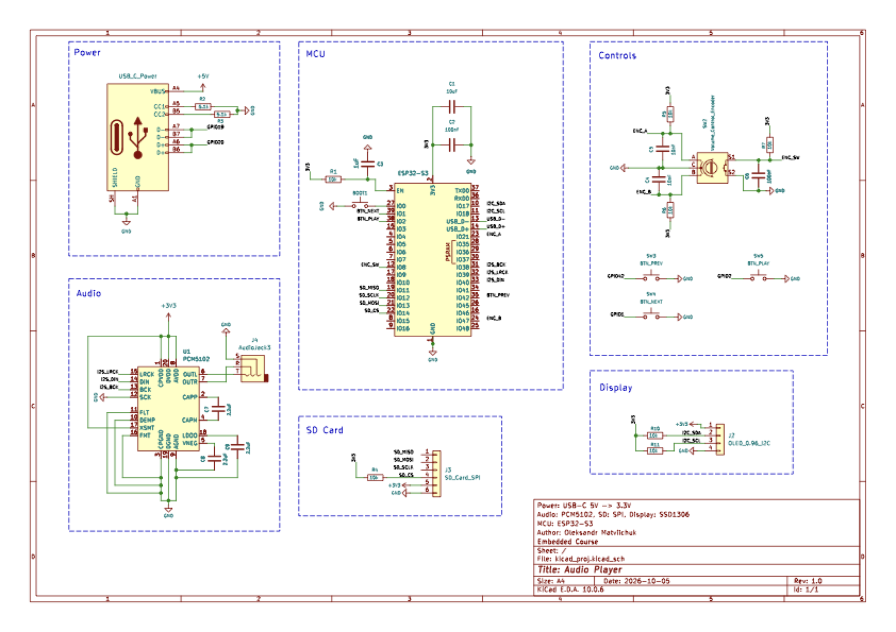

# ESP32-S3 Audio Player

> A portable MP3 / WAV player on ESP32-S3: software decoding, I2S DAC, SD card, OLED UI, and control from buttons, an encoder or a phone over BLE.

[](https://platformio.org/)
[](https://www.espressif.com/en/products/socs/esp32-s3)
[](https://www.freertos.org/)
[](LICENSE)

## About

The firmware reads `.mp3` and `.wav` files from an SD card, decodes them on the ESP32-S3 and plays them
through a PCM5102 DAC over I2S. A 128x64 OLED shows the track list, elapsed / total time and the
volume. Local controls (3 buttons + a rotary encoder) and a BLE phone control feed the same command
queue, so they are interchangeable.

It is the final project of an embedded systems course, written in C on native ESP-IDF with FreeRTOS.
It combines SPI, I2C, I2S, GPIO interrupts, PCNT and BLE in one real device.

**Features**

- MP3 (Helix, MPEG Layer III) and WAV (16-bit PCM, mono / stereo); exact MP3 duration from the Xing/Info header
- Track list with a highlighted current track; a long title scrolls horizontally
- Play / pause, next, previous, volume with the encoder, mute with the encoder click
- Auto-advance to the next track
- SD hot-plug: warning screen on removal; on return the card is re-scanned and the current track restarts
- Debug options in `menuconfig` instead of code edits



## Quick start

**You need:** [PlatformIO](https://platformio.org/) (CLI or VS Code extension), an ESP32-S3-DevKitM-1
wired as in [docs/hardware.md](docs/hardware.md), and a microSD card formatted as **FAT32** with
`.mp3` / `.wav` files in the root directory.

```bash
git clone https://github.com/sashkomatviychuk/esp32s3-audio-player.git
cd esp32s3-audio-player
pio run -t upload        # build and flash (dependencies are fetched on the first build)
pio device monitor       # serial log, 115200 baud
```

Use the board's USB port (built-in USB-Serial-JTAG). On success the log starts with
`MP3/WAV player starting up`, and the display shows the track list.

| Control | Action |
|---|---|
| Play/Pause button | Play / pause |
| Next / Prev buttons | Next / previous track |
| Encoder rotation / click | Volume / mute |
| BLE (`MP3 Player`) | Same commands from a phone, see [usage](docs/usage.md#ble-control) |

No sound or something not working? See [troubleshooting](docs/usage.md#troubleshooting).

## Documentation

| Document | Contents |
|---|---|
| [docs/hardware.md](docs/hardware.md) | Parts, pin map, schematic, wiring notes (PCM5102, SD card) |
| [docs/usage.md](docs/usage.md) | Controls, BLE protocol, menuconfig options, troubleshooting |
| [docs/architecture.md](docs/architecture.md) | Modules, data flow, playback state machine, design decisions |
| [docs/development.md](docs/development.md) | Tool versions, build, host tests, code style, references |
| [docs/lessons.md](docs/lessons.md) | Results, lessons learned, limitations, roadmap |

Public headers in [`include/`](include) describe each module's contract, including locking behavior.

## Tech stack

C, ESP32-S3, ESP-IDF (via PlatformIO), FreeRTOS (queues, mutexes, task notifications, `esp_timer`),
SPI (SD, FATFS), I2S (PCM5102), I2C (SSD1306), PCNT (quadrature encoder), GPIO interrupts,
NimBLE (BLE GATT), Helix MP3 decoder, Kconfig, clang-format / clang-tidy.

## Known limitations

MP3 Layer III only and no seeking; WAV 16-bit PCM only; track list from the SD root, 64 files, Latin
font. Full list and roadmap: [docs/lessons.md](docs/lessons.md#known-limitations).

## Author

Oleksandr Matviichuk - [@sashkomatviychuk](https://github.com/sashkomatviychuk)

Released under the [MIT License](LICENSE).
