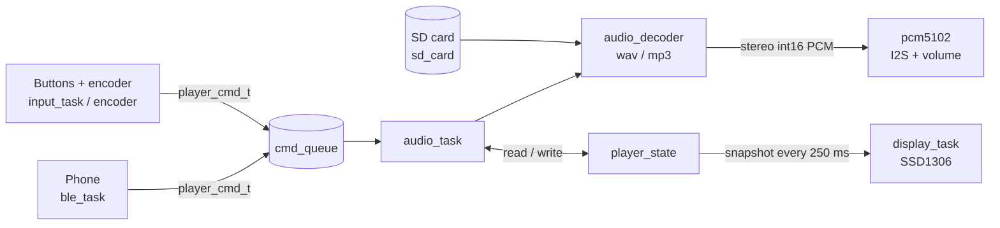
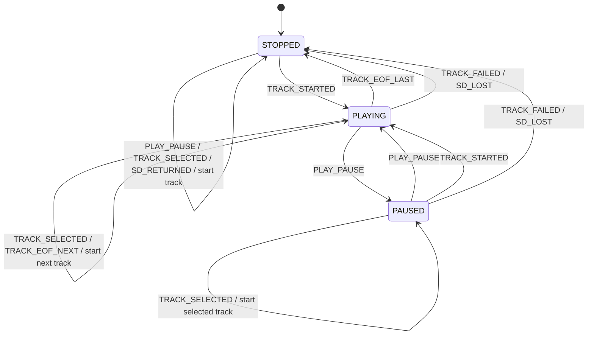

# Architecture

[← Back to README](../README.md)

## Overview



## Modules

| Module | Responsibility |
|---|---|
| `audio_task` | Playback loop: commands, track switching, auto-advance, elapsed time |
| `audio_decoder`, `wav_decoder`, `mp3_decoder` | Decoder interface; every decoder returns interleaved stereo int16, so the I2S format never changes. A new format is one `*_decoder.c` file |
| `pcm5102` | I2S0 output over DMA, software gain and mute |
| `sd_card` | SPI2 mount at 4 MHz, track scan, hot-plug monitor |
| `player_fsm` | Playback state machine: a pure transition table (`STOPPED` / `PLAYING` / `PAUSED`), unit-tested on the host |
| `player_state` | Single mutex-protected player state; other tasks read a consistent snapshot |
| `display`, `display_task`, `display_views` | Framebuffer drawing, view routing (`PLAYER`, `NO_SD`), scrolling title |
| `input_task`, `encoder` | GPIO edge interrupt + 30 ms `esp_timer` debounce; PCNT x4 quadrature decoding |
| `ble_task` | NimBLE GAP peripheral + GATT server |
| `wav_info`, `mp3_info` | Header parsing: format, ID3v2, first frame, duration |

## Playback state machine

Playback is a table-driven finite state machine in [`player_fsm`](../src/player_fsm.c). It is a pure
function `(state, event) -> (next state, action)` with no RTOS or I/O calls. `audio_task` feeds it
events (button / BLE commands, end of file, errors, SD removal and return), publishes the new state
through `player_state` for the display, and executes the returned action (`START_TRACK`). Invalid
`(state, event)` pairs are rejected and logged instead of silently changing state.



| Event | Source |
|---|---|
| `PLAY_PAUSE`, `TRACK_SELECTED` | Play/Pause, Next, Prev (buttons or BLE) |
| `TRACK_STARTED`, `TRACK_FAILED` | the track file was opened / could not be played |
| `TRACK_EOF_NEXT`, `TRACK_EOF_LAST` | end of file, with or without a next track |
| `SD_LOST`, `SD_RETURNED` | card removed or read error / card back within 30 s |

## Design decisions

- **Event-driven input.** No polling or `vTaskDelay` for buttons: ISR -> task -> debounce timer -> queue.
- **One owner of the state.** `audio_task` is the only writer of the playback state; the display only reads `player_state` and never talks back.
- **Explicit locking contract.** One `spi_mutex` serializes SD access between the audio task and the SD
  monitor; each function documents whether it takes the mutex itself.
- **Format-independent output.** The decoder interface hides the file type from I2S, volume and the audio task.
- **Optional peripherals.** The display, buttons, encoder and BLE only send commands or read state, so a failed init is logged and the player keeps working.

## Repository layout

```
include/   public headers with detailed (locking-aware) doc comments
src/       firmware modules, Kconfig.projbuild, idf_component.yml
tools/     host-side tests (state machine)
docs/      documentation
partitions.csv, sdkconfig.defaults   2 MB flash layout and build defaults
.clang-format, .clang-tidy           Google-based style, 2 spaces, 100 columns
```
